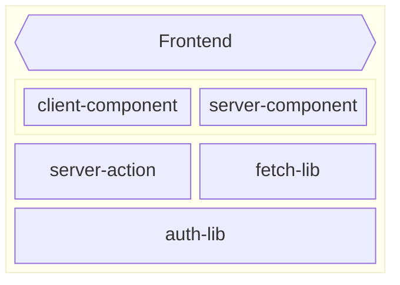
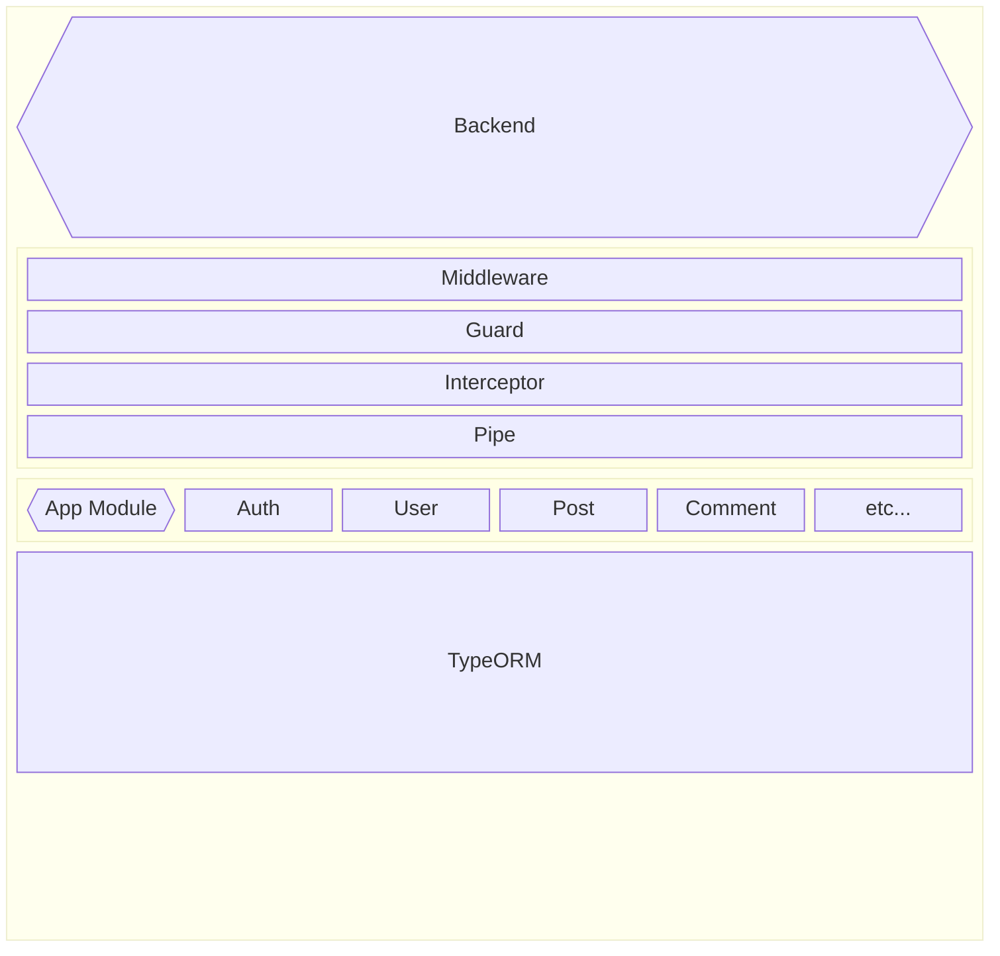

## Project : Small Quest

A CRUD communiuty where uses can
- enjoy other user's Quest post, 
- evaluate other user's result of Quest
- Create Quest.

Quest is a post which creator request for other user to do small something .

Community is managed based on Quest ticket which user consumes when create Quest and gets when user's result is evaluated to success


## Getting Started
### Requirments
- Node.js
- cloudinary accounts 
- postgres DB

### Installation

1. git clone 

2. Navigate to both the frontend and backend directories: 

3. install npm package

4. rename .env,example to .env and fill in the environment variables in both directories. 
- Backend: Use `.env.local` or `.env.server`. The app uses "cross-env NODE_ENV=..." to reference the appropriate file.
- You can modify the .env file selection in `back/main-server/package.json`.

5. Build the applications:
Backend:

```
back/main-server $ npm run build
```

Frontend:
```
front $ npm run build
```

6. Build the applications:
Backend:
```
back/main-server $ npm run start
```

Frontend:
```
front $ npm run start
```
    
## Technical Stack

### Common
[](https://skillicons.dev)
- TypeScript 
- git

### FrontEnd
[](https://skillicons.dev)
- Next.js 
- Chakra-UI
- Cloudinary

### Backend 
[](https://skillicons.dev)

- Nest.js
- TypeORM, 

### DataBase
[](https://skillicons.dev)

- postgresSQL,

## Deployment
- Hostend on AWS EC2 

## Structure

### Front



### Backend

